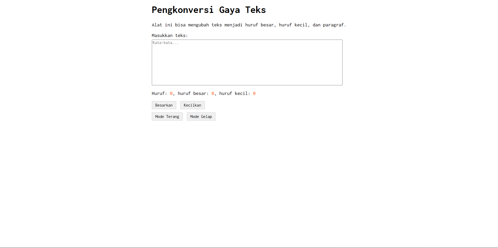
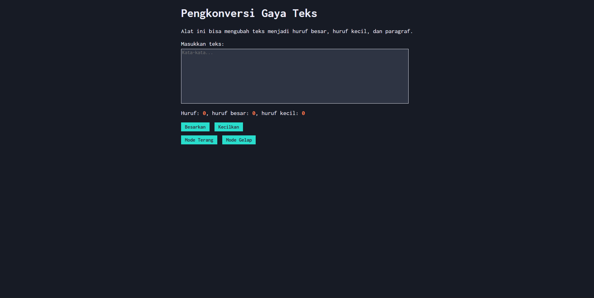
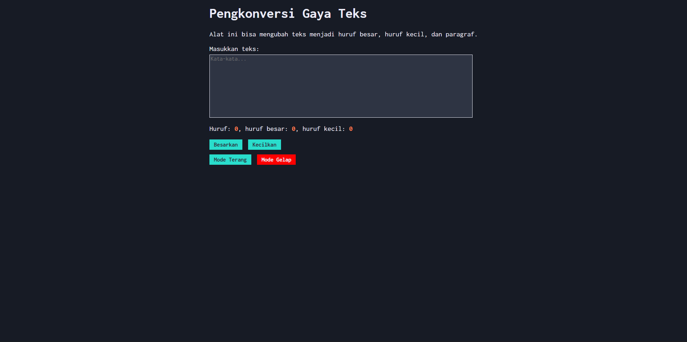

# TM 04_Automata_dan_Table-driven_Construction

`Adhi Puspo Hadikusumo`

`103122430002`

`S1SE-08-02`

`Dosen pengampu: Yudha Islami Sulistiya`

`Asisten Praktikum: Adhiansyah Ancha & Hamid Khaeruman`

## Soal

Tambahkan mode gelap sekaligus untuk editor-kecil dan tombol-tombolnya. Ketentuan warna untuk latar belakang editor-kecil adalah #2e3443, sementara untuk tombol adalah #29ddcc. Teks untuk tombol tetap mengikuti warna teks sebelumnya.

Untuk menghapus pinggiran tombol, nyatakan properti `border` untuk tidak ditunjukkan.

## Kode Sumber

Ada di [index.html](./index.html) , [index.js](./index.js) dan , [index.css](./index.css)

## Output
  

## Deskripsi

Pada Dokumen ini, saya menambahkan fitur mode terang dan mode gelap pada page sesuai dengan soal. Fitur ini untuk mengganti tampilan light atau dark mode.

Ketika btn Mode Gelap diclick, tampilan page akan berubah menjadi lebih gelap. Perubahannya juga termasuk background page, kotak input teks, serta button yang ada. Lalu sebaliknya, jika btn Mode Terang ditekan, tampilan akan kembali seperti semula.

Untuk mengimplementasikan fungsi tersebut, saya menambahkan :
```
<button id="tombol-terang">Mode Terang</button>
<button id="tombol-gelap">Mode Gelap</button>
```
Pada bagian HTML di atas, saya menambahkan dua button untuk mode terang ataupun mode gelap

```
.dark-mode {
    background-color: #171b25;
    color: #EBECF7;
}

.dark-mode .kotak-input {
    background-color: #2e3443;
    color: #ebecf7;
    border: 1px solid #ebecf7;
}

.dark-mode button {
    background-color: #29ddcc;
    font-weight: bold;
    border: none;
    color: #2e3443;
}

.dark-mode button:hover {
    background-color: red;
    font-weight: bold;
    border: none;
    color: #ebecf7;
}

.dark-mode .container {
    background-color: #171b25;
}
```
Pada bagian CSS nya, saya menggunakan class `.dark-mode` untuk tampilan saat mode gelap. Warna background editor diubah menjadi `#2e3443`, sedangkan button diubah menjadi `#29ddcc` sesuai ketentuan soal. Properti `border: none;` juga ditambahkan agar pinggiran button tidak ditampilkan. Disitu saya juga sedikit mengvariasikan dengan adanya hover pada button saat kursor mengarah ke btn nya, untuk btn hovernya saya ubah menjadi `red` dan warna font nya menjadi `#ebecf7`

```
buttonDarkElement.addEventListener("click", (event) => {
    document.documentElement.classList.add("dark-mode");
});
```
Code di atas digunakan untuk mengaktifkan dark mode. Ketika button ditekan, class `dark-mode` akan ditambahkan ke elemen utama sehingga seluruh aturan CSS yang terkait akan diterapkan.

```
buttonLightElement.addEventListener("click", (event) => {
    document.documentElement.classList.remove("dark-mode");
});
```
Nah kalau code di atas ini berfungsi untuk menonaktifkan dark mode. Dengan menghapus kelas `dark-mode`, tampilan halaman akan kembali ke mode terang benderang.

Itu saja yang bisa saya jelaskan, arigatouuu ~~~