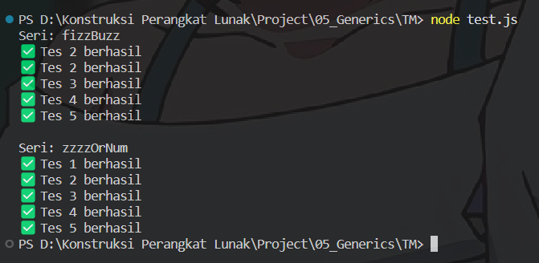

# TM 05_Generics

`Adhi Puspo Hadikusumo`

`103122430002`

`S1SE-08-02`

`Dosen pengampu: Yudha Islami Sulistiya`

`Asisten Praktikum: Adhiansyah Ancha & Hamid Khaeruman`

## Soal

Diberikan program `index.js`seperti ini:
```
// Tambah JSDoc di sini
function zzzzOrNum(value) {
    // Ubah kode di sini
}

// Tambah JSDOC di sini
function fizzBuzz(sequence) {
    // Ubah kode di sini

    const newSequence = sequence.map((e) => zzzzOrNum(e));

    return newSequence;
}

module.exports = {
    fizzBuzz: fizzBuzz,
    zzzzOrNum: zzzzOrNum,
};
```
Aturan FizzBuzz kali ini adalah:

1. Fungsi fizzBuzz hanya menerima larik yang semua elemennya terdiri dari bilangan bulat dan mengeluarkan larik pula yang bisa jadi bercampur string dan bilangan
2. Fungsi zzzzOrNum hanya menerima sebuah data tunggal berupa bilangan bulat dan mengembalikan "Fizz", "FizzBuzz", "Buzz", atau bilanga bulat sesuai logikanya
3. Kedua fungsi harus ada dan harus disertai JSDoc sesuai tipe data yang disiratkan dari no. 1, no. 2, dan perilaku yang diharapkan di bawah
4. fizzBuzz harus menggunakan fungsi zzzzOrNum di dalamnya

Gunakan `konfigurasi` ini untuk `tsconfig.json` dan `test.js` ini untuk menguji kode yang kamu buat.

## Kode Sumber

Ada di [index.js](./index.js), [test.js](./test.js), dan [tsconfig.json](./tsconfig.json)

## Output



## Deskripsi

Di program ini, saya menyempurnakan dua fungsi yang sudah disediakan pada file `index.js`, yaitu `zzzzOrNum` dan `fizzBuzz`, agar dapat bekerja sesuai dengan aturan FizzBuzz yang diminta.

Pertama, pada fungsi `zzzzOrNum` saya mengatur agar fungsi ini hanya memproses satu nilai berupa angka. Sebelum melakukan perhitungan, ditambahkan validasi untuk memastikan bahwa input benar-benar bertipe number. Jika tidak sesuai, maka fungsi akan melempar error.

Selanjutnya, fungsi akan melakukan pengecekan berdasarkan aturan `FizzBuzz`. Jika angka merupakan kelipatan 15, maka akan menghasilkan `"FizzBuzz"`. Jika hanya kelipatan 3, maka menghasilkan `"Fizz"`, dan jika kelipatan 5 akan menghasilkan `"Buzz"`. Apabila tidak memenuhi ketiga kondisi tersebut, maka nilai angka akan dikembalikan tanpa perubahan.

Kemudian, pada fungsi `fizzBuzz`, saya mengatur agar fungsi ini menerima data berupa array. Sama seperti sebelumnya, dilakukan pengecekan terlebih dahulu untuk memastikan bahwa input yang diberikan memang berupa array. Jika tidak, maka akan muncul error.

Setelah itu, setiap elemen dalam array diproses menggunakan method map, di mana masing-masing nilai akan diteruskan ke fungsi `zzzzOrNum` untuk dikonversi sesuai aturan yang telah dibuat.

Hasil akhirnya akan berupa array baru yang berisi kombinasi antara string dan number sesuai dengan hasil pengolahan `FizzBuzz`.

Selain itu, terdapat sedikit penyesuaian pada file test.js, yaitu pada bagian import module. Seharusnya menggunakan:
```
const fb = require("./index.js");
```
bukan
```
const fb = require("./fizz.js");
```
agar sesuai dengan nama file yang digunakan. (pantes aja ko ga berhasil berhasil :v)

Itu saja sih yang bisa saya jelaskan, arigatouuu ~~~