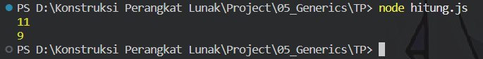

# TP 05_Generics

`Adhi Puspo Hadikusumo`

`103122430002`

`S1SE-08-02`

`Dosen pengampu: Yudha Islami Sulistiya`

`Asisten Praktikum: Adhiansyah Ancha & Hamid Khaeruman`

## Soal

Ini adalah kode yang mengurus jumlah semua karakter dan jumlah huruf:
```
const str = "Bar bar";

let jumlahSemua = 0;
for (const c of str) { 
    jumlahSemua++; 
}
console.log(total);

let jumlahHuruf = 0;
for (const c of str) { 
    if (c === ' ') continue;
    jumlahHuruf++;
}
console.log(letters);
```
Bagaimana caramu hanya dengan satu fungsi generik bisa mengurus keduanya?

Agar fungsi yang kamu kerjakan benar atau tidak, berikut ini adalah kode tes yang bisa kamu tempelkan:
```
const str = "Bar bar bar";
...
console.log(
   hitung(str, "semua") // Harusnya 11
);

console.log(
  hitung(str, "huruf") // Harusnya 9
);

hitung(str, "huruf"); // Tidak terjadi apa-apa
```

## Kode Sumber

Ada di [hitung.js](./hitung.js)

## Output



## Deskripsi

jawabannya cukup simple, kita satukan kedua looping function tsb menjadi 1 fungsi generik
```
function hitung(str, mode)
```
dari sini kita langsung masukkan kedua fungsi menjadi satu function (sebut saja hitung)
```
let jumlah = 0;
```
lalu gunakan `let` buat nyimpen hasil hitungan
```
for (const c of str)
```
lalu ambil satu per satu karakter dari string
```
if (mode === "semua") {
    jumlah++;
}
```
gunakan perkondisian yang dimana ketika `mode === "semua"` maka semua karakter dihitung termasuk space
```
else if (mode === "huruf") {
    if (c === ' ') continue;
    jumlah++;
}
```
lalu apabila ketemu space maka akan skip dan lompat ke iterasi berikutnya
setelah itu baru `return jumlah`

Itu saja yang bisa saya jelaskan, arigatouuu ~~~