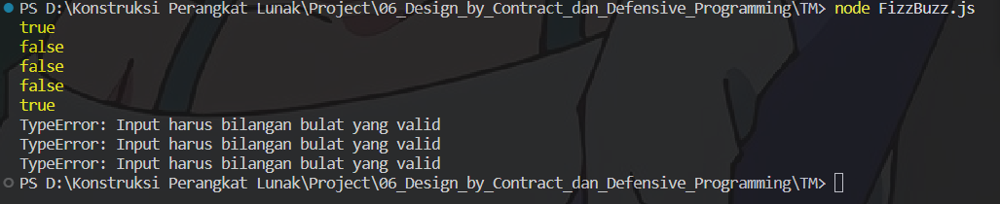

# TM 06_Design_by_Contract_dan_Defensive_Programming

`Adhi Puspo Hadikusumo`

`103122430002`

`S1SE-08-02`

`Dosen pengampu: Yudha Islami Sulistiya`

`Asisten Praktikum: Adhiansyah Ancha & Hamid Khaeruman`

## Soal

Lindungi kode ini dari bilangan-bilangan "fizz buzz"!

Tugasmu adalah membuat fungsi yang menolak bilangan-bilangan kelipatan 3, 5, atau 15, menerima bilangan-bilangan bukan "fizz buzz", dan melempar yang bukan bilangan bulat.

```
function is_not_fizzbuzz(number) {
  // TODO
}

console.log(is_not_fizzbuzz(1)) // true
console.log(is_not_fizzbuzz(3)) // false
console.log(is_not_fizzbuzz(5)) // false
console.log(is_not_fizzbuzz(30)) // false
console.log(is_not_fizzbuzz(7)) // true
console.log(is_not_fizzbuzz(null)) // Lempar TypeError
console.log(is_not_fizzbuzz(NaN)) // Lempar TypeError
console.log(is_not_fizzbuzz(Infinity)) // Lempar TypeError
```

## Kode Sumber

Ada di [hitung.js](./FizzBuzz.js)

## Output



## Deskripsi

```
function is_not_fizzbuzz(number) {
  if (typeof number !== 'number' || !Number.isInteger(number) || !Number.isFinite(number)) {
    return 'TypeError: Input harus bilangan bulat yang valid';
  }

  if (number % 3 === 0 || number % 5 === 0) {
    return false;
  }

  return true;
}
```

Kode diatas untuk membuat sebuah fungsi yang mampu memvalidasi dan mengklasifikasikan suatu bilangan berdasarkan aturan tertentu. Fungsi harus menerima sebuah input berupa bilangan bulat, kemudian menentukan apakah bilangan tersebut termasuk dalam kategori “fizz buzz”, yaitu kelipatan 3, 5, atau keduanya. Jika termasuk, maka fungsi akan menolak nilai tersebut dengan mengembalikan nilai false, sedangkan jika bukan kelipatan 3 maupun 5, maka fungsi akan menerima dengan mengembalikan nilai true. Selain itu, fungsi juga harus menerapkan validasi ketat terhadap input, yaitu hanya menerima bilangan bulat yang valid dan melempar kesalahan (TypeError) jika input bukan angka, bukan bilangan bulat, atau memiliki nilai yang tidak terdefinisi seperti NaN atau Infinity. Secara keseluruhan, tugas ini menekankan pada penerapan konsep validasi input dan defensive programming untuk memastikan fungsi berjalan dengan aman dan sesuai aturan.

Itu saja yang bisa saya jelaskan, arigatouuu ~~~