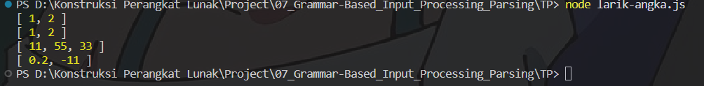

# TP 07_Grammar-Based_Input_Processing_Parsing

`Adhi Puspo Hadikusumo`

`103122430002`

`S1SE-08-02`

`Dosen pengampu: Yudha Islami Sulistiya`

`Asisten Praktikum: Adhiansyah Ancha & Hamid Khaeruman`

## Soal

Buatlah fungsi yang mengubah deretan angka bertipe string menjadi larik angka.
```
function toNumberArray(number) {
  // TODO
}

console.log(toNumberArray("1, 2")) // [1, 2]
console.log(toNumberArray(["1", "2"])) // [1, 2]
console.log(toNumberArray(" 11,55,33   ")) // [11, 55, 33]
console.log(toNumberArray(["0.2", "-11", "abc23"])) // [0.2, -11]
```

## Kode Sumber

Ada di [hitung.js](./larik-angka.js)

## Output



## Deskripsi

```
function toNumberArray(number) {
    let result = [];
  
    if (typeof number === 'string') {
      number = number.trim();
      number = number.split(',');
    }
  
    if (Array.isArray(number)) {
      for (let i = 0; i < number.length; i++) {
        let item = number[i].toString().trim();
  
        let num = Number(item);
  
        if (!isNaN(num)) {
          result.push(num);
        }
      }
    }
  
    return result;
}
```

Kode untuk mengubah data masukan yang masih berupa teks atau larik string menjadi sebuah larik angka yang valid. Proses yang dilakukan merupakan bagian dari parsing, yaitu menguraikan data mentah menjadi struktur yang lebih terorganisir dan dapat digunakan dalam program. Langkah utamanya meliputi memisahkan elemen-elemen data (jika berupa string), membersihkan spasi yang tidak diperlukan, mengonversi setiap elemen menjadi tipe angka, serta melakukan validasi untuk memastikan hanya nilai yang benar-benar berupa angka yang dimasukkan ke dalam hasil akhir. Dengan demikian, output yang dihasilkan adalah larik angka yang bersih, valid, dan siap digunakan untuk proses selanjutnya.

Itu saja yang bisa saya jelaskan, arigatouuu ~~~