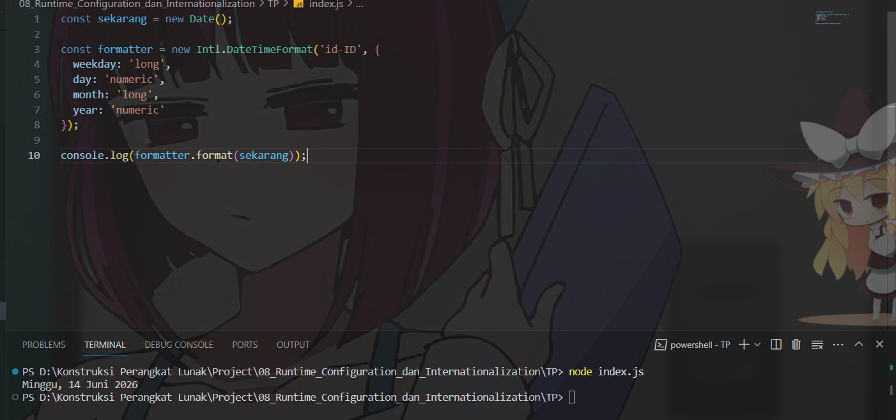

# TP 08_Runtime_Configuration_dan_Internationalization

`Adhi Puspo Hadikusumo`

`103122430002`

`S1SE-08-02`

`Dosen pengampu: Yudha Islami Sulistiya`

`Asisten Praktikum: Adhiansyah Ancha & Hamid Khaeruman`

## Soal

Tampilkan tanggal sekarang dengan format seperti ini:

`Sabtu, 18 April 2026`

Nilai waktu tidak harus sama, asalkan formatnya benar dan bisa tampil di komputer terpisah pada waktu tertentu. Gunakan Intl.DateTimeFormat (bukan string manual).

## Kode Sumber

- [index.js](./index.js)

## Output

## Deskripsi Program

Penggunaan `new Date()` untuk mengambil waktu saat ini secara otomatis dari sistem, untuk tanggalnya tidak ditulis manual dan bisa berubah sesuai waktu saat ini. Next buat formatter dengan `Intl.DateTimeFormat` menggunakan locale `'id-ID'` agar formatnya menggunakan bahasa Indo. Setelah itu hanya memformat tanggal menggunakan formatter tersebut, sehingga hasilnya sesuai soal yaitu `“Minggu, 14 Juni 2026”`.

Itu saja yang bisa saya jelaskan, arigatouuu ~~~