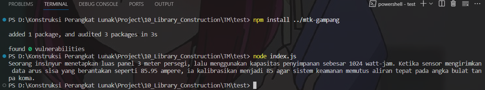
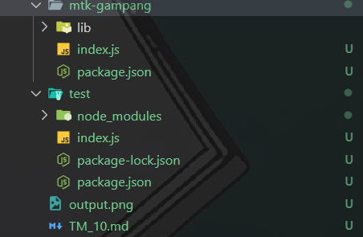

# TM 10_Library_Construction

`Adhi Puspo Hadikusumo`

`103122430002`

`S1SE-08-02`

`Dosen pengampu: Yudha Islami Sulistiya`

`Asisten Praktikum: Adhiansyah Ancha & Hamid Khaeruman`

## Soal

Buatkan pustaka yang rapi!

Pada tugas ini buatlah sebuah proyek baru bernama mtk-gampang. Struktur proyeknya wajib diatur seperti di bawah ini.

```
|── package.jso
├── index.js
├── lib/
   ├── kuadrat.js
   ├── pangkat.js
   |── bulat.js
```

Setiap berkas lib hanya memiliki satu fungsi saja.

1. pangkat.js berisi fungsi pangkat(x, y) yang mengembalikan nilai akhir dari x pangkat y.
2. bulat.js berisi fungsi bulat(x) yang mengubah bentuk bilangan non-bulat menjadi bulat (mis. -4.25 menjadi -4) .
3. kuadrat.js berisi fungsi kuadrat(x) yang mengembalikan nilai akar kuadrat 2 dari x.

Satu batasannya adalah fungsi-fungsi ini harus diakses dari index.js (sebagai nilai dari properti main), bukan dari lib masing-masing.

Jika sudah selesai, buatlah proyek baru lagi dan instal pustaka yang kamu buat secara lokal. Pada index.js-nya, gunakan kode ini untuk memastikan bahwa kamu berhasil melakukannya.

```
import { kuadrat, pangkat, bulat } from "libr";

const narasi = `Seorang insinyur menetapkan luas panel ${bulat(kuadrat(12))} meter persegi, lalu menggunakan kapasitas penyimpanan sebesar ${pangkat(2, 10)} watt-jam. Ketika sensor mengirimkan data arus sisa yang berantakan seperti 85.95 ampere, ia kalibrasikan menjadi ${bulat(85.95)} agar sistem keamanan memutus aliran tepat pada angka bulat tanpa koma.`;

/**
* Seorang insinyur menetapkan luas panel 3 meter persegi, lalu menggunakan kapasitas penyimpanan sebesar 1024 watt-jam. Ketika sensor mengirimkan data arus sisa yang berantakan seperti 85.95 ampere, ia kalibrasikan menjadi 85 agar sistem keamanan memutus aliran tepat pada angka bulat tanpa koma.
* /
```

## Kode Sumber

Untuk library Ada di :
- [index.js](./mtk-gampang/index.js) 
- [bulat.js](./mtk-gampang/lib/bulat.js) 
- [kuadrat.js](./mtk-gampang/lib/kuadrat.js)
- [pangkat.js](./mtk-gampang/lib/pangkat.js) 

untuk code test nya ada di :
- [index.js](./test/index.js)

## Output



## Deskripsi Program

Saya membuat `mtk-gampang` untuk library matematika sederhana. Lalu di dalam project nya saya membuat folder `lib` yang isinya ada tiga file, yaitu `pangkat.js`, `bulat.js`, dan `kuadrat.js`.

Di file `pangkat.js`, saya membuat fungsi `pangkat(x, y)` yang dipakai untuk menghitung hasil perpangkatan dari x ke y menggunakan operator `**`. Lalu di `bulat.js`, saya membuat fungsi `bulat(x)` yang gunanya untuk menghilangkan angka desimal tanpa pembulatan ke atas atau ke bawah, jadi pakai `Math.trunc()`. Setelah itu di `kuadrat.js`, saya membuat fungsi `kuadrat(x)` yang dipakai untuk menghitung akar kuadrat dari suatu angka menggunakan `Math.sqrt()`.

Selanjutnya saya membuat folder baru untuk test. Lalu saya install library ini secara lokal pakai `npm install ../mtk-gampang` di folder test tadi. nah kan nanti akan muncul node_modules dengan mtk-gampang. :



Setelah itu di file `index.js` di [test](./test/), saya import fungsi dari library dengan:

```
import { kuadrat, pangkat, bulat } from "libr";
```

Itu saja yang bisa saya jelaskan, arigatouuu ~~~